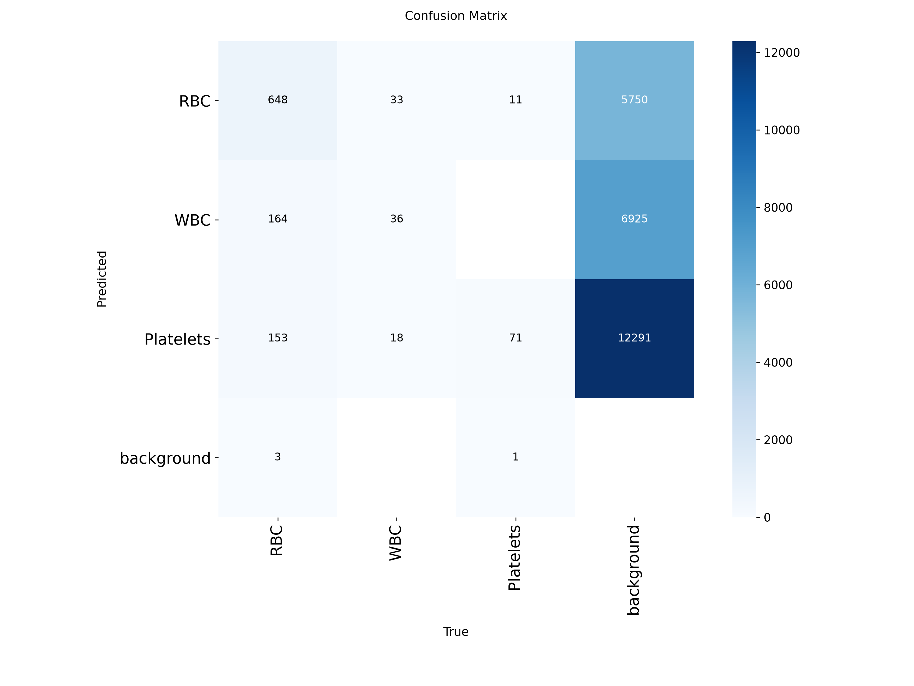
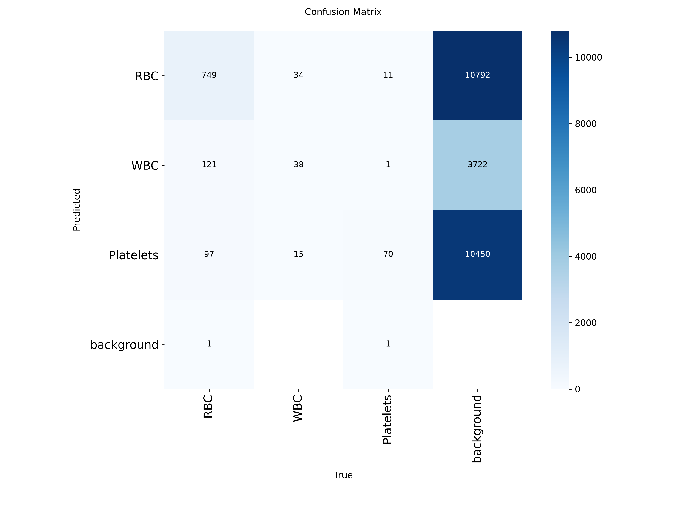
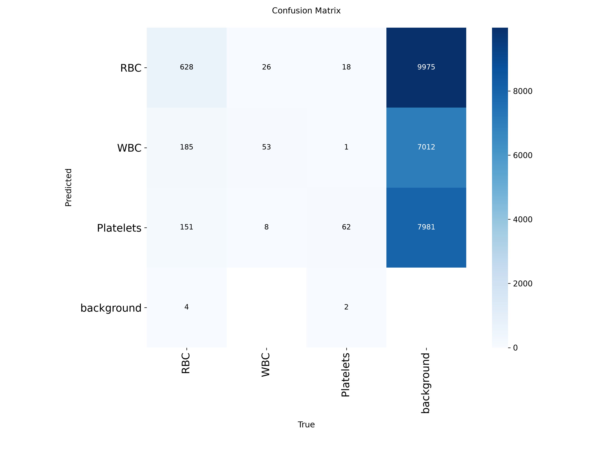
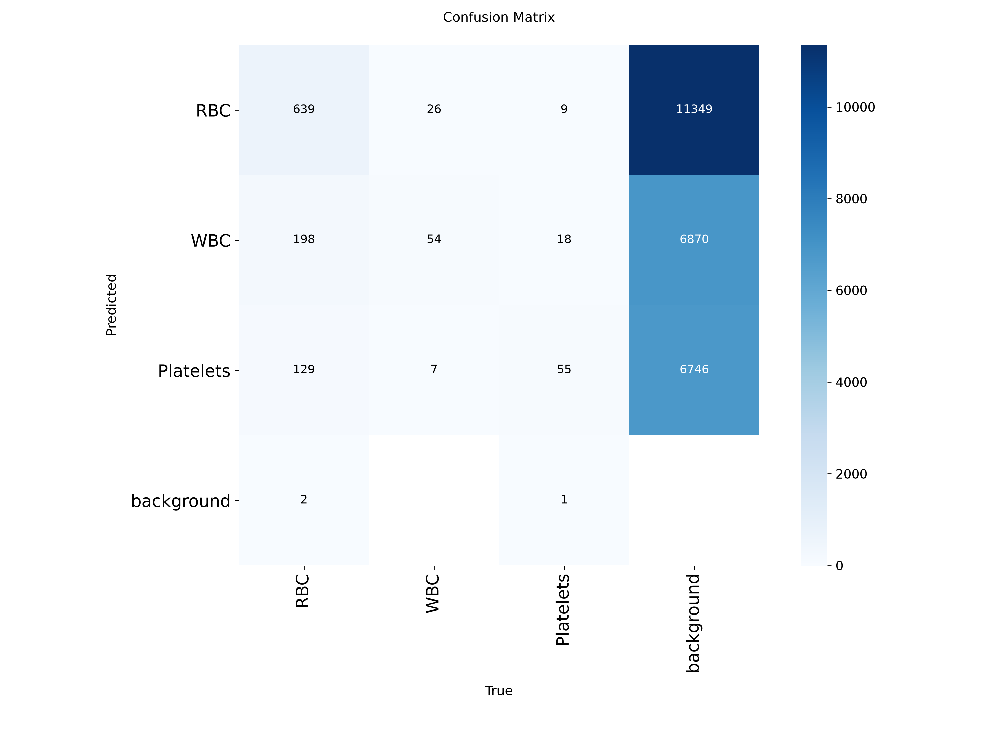

# Blood Cell Count and Detection (YOLOv8 / YOLOv11)

Kaggleの「Blood Cell Count and Detection」データセットを使用し、顕微鏡画像内の赤血球（RBC）、白血球（WBC）、血小板（Platelets）をリアルタイムかつ高精度に自動検出するモデル構築・検証プロジェクトです。

## 1. プロジェクト概要

* **目的:** 医療画像解析における血球の自動検出・高精度分類、およびモデル・データ拡張手法の違いによる定量的な性能比較
* **検出対象クラス (3種):**
* `0`: **RBC** (Red Blood Cell / 赤血球)
* `1`: **WBC** (White Blood Cell / 白血球)
* `2`: **Platelets** (血小板)


* **主な取り組み:**
1. Supervisely形式（JSON）からYOLOフォーマット（.txt）への自作スクリプトによる自動変換
2. YOLOv8n によるベースラインモデルの構築と定量評価
3. **アブレーション実験:** YOLOv8 vs YOLOv11、および Data Augmentation（Mosaic / Mixup）の有無による比較検証


## 2. 開発環境・使用ツール

* **Language:** Python 3
* **Framework:** PyTorch, Ultralytics (YOLOv8n / YOLOv11n)
* **Libraries:** OpenCV, NumPy, Matplotlib, PyYAML
* **Environment / Package Management:** uv, VSCode
* **Version Control:** Git / GitHub


## 3. ディレクトリ構成

```text
.
├── data/
│   ├── row/                 # Raw dataset (Supervisely / JSON format)
│   └── dataset/             # YOLO format converted
│       ├── images/          # train / val / test
│       └── labels/          # train / val / test (.txt)
├── convert_bccd_json.py     # JSON -> YOLO .txt 座標正規化変換スクリプト
├── train.py                 # 学習・実験実行スクリプト
├── data.yaml                # データセット設定ファイル
└── README.md

```


## 4. 実験手順・実行方法

### ① データ前処理 (JSON ➔ YOLO .txt 変換)

Supervisely形式の `classTitle` および `points.exterior` を解析し、YOLOフォーマット（`class_id x_center y_center width height` ※0〜1正規化）へ変換して自動配置します。

```bash
python3 convert_bccd_json.py
```

### ② モデル比較・アブレーション実験の実行

データ拡張の有無およびモデルアーキテクチャの違いによる影響を検証するため、以下の4条件で揃えて実験を行います。

```bash
# 1. YOLOv8 ベースライン (Augmentationなし)
python3 train.py --model yolov8n.pt --epochs 20 --batch 8 --mosaic 0.0 --mixup 0.0 --name exp_base

# 2. YOLOv8 + Augmentation (Mosaic & Mixup)
python3 train.py --model yolov8n.pt --epochs 20 --batch 8 --mosaic 0.5 --mixup 0.5 --name exp_aug_mixup

# 3. YOLOv11 ベースライン (Augmentationなし)
python3 train.py --model yolo11n.pt --epochs 20 --batch 8 --mosaic 0.0 --mixup 0.0 --name exp_base_v11

# 4. YOLOv11 + Augmentation (Mosaic & Mixup)
python3 train.py --model yolo11n.pt --epochs 20 --batch 8 --mosaic 0.5 --mixup 0.5 --name exp_aug_mixup_v11
```


## 5. 実験結果・評価分析

### 1. 初回ベースラインモデル (`exp_base` / 20 Epochs) の結果

* **全体精度 (mAP@50):** **`0.912` (91.2%)**

| クラス名 | mAP@50 | 検出傾向・考察 |
| --- | --- | --- |
| **WBC (白血球)** | **0.991 (99.1%)** | 大型かつ特徴的な構造のため、ほぼ完璧に検出・識別可能 |
| **RBC (赤血球)** | **0.880 (88.0%)** | 画像内に高密度で重なり合って存在しても、安定して検出 |
| **Platelets (血小板)** | **0.865 (86.5%)** | 微小な物体サイズながら実用的な精度で検出可能 |

### 2. 混同行列（Confusion Matrix）による詳細分析

| YOLOv8 Base (`exp_base`) | YOLOv8 + Augmentation (`exp_aug_mixup`) |
| :---: | :---: |
|  |  |

| YOLOv8 Base (`exp_base`) | YOLOv8 + Augmentation (`exp_aug_mixup`) |
| :---: | :---: |
|  |  |

#### 📊 分析・考察
* **全体傾向:** 
  * いずれのモデルでも正解ラベル（True）における見落とし（`background` への誤分類）は極めて少なく、高い再現率（Recall）を維持している。
* **クラス別の課題:** 
  * `Platelets`（血小板）はサイズが極小であるため、他の2クラス（RBC/WBC）と比較して微小な位置ズレによる `background` への誤判定が僅かに残る。


### 3. 比較実験マトリクス (20 Epochs アブレーション実験)

全実験において Epochs: 20, Batch Size: 8 に条件を統一し、モデル構造およびデータ拡張の影響を評価しました。

| 実験名 | モデル | Mosaic | Mixup | mAP50 | mAP50-95 | Precision | Recall | 推論速度 (ms) |
| :--- | :---: | :---: | :---: | :---: | :---: | :---: | :---: | :---: |
| `exp_base` | YOLOv8n | 0.0 | 0.0 | 0.912 | 0.630 | 0.856 | 0.885 | 200.7 |
| `exp_aug_mixup` | YOLOv8n | 0.5 | 0.5 | 0.917 | 0.632 | 0.849 | 0.900 | 218.2 |
| **`exp_base_v11`** | **YOLOv11n** | **0.0** | **0.0** | **0.918** | **0.638** | **0.854** | **0.901** | **189.3** |
| `exp_aug_mixup_v11` | YOLOv11n | 0.5 | 0.5 | 0.914 | 0.628 | 0.856 | 0.878 | 194.9 |

#### 考察
1. **アーキテクチャの進化（YOLOv8 vs YOLOv11）:**
   最高精度および最速の処理性能を達成したのは **YOLOv11n (`exp_base_v11`)** であり、mAP50: **91.8%**、推論速度: **189.3ms** を記録。YOLOv8と比較してバックボーン等の構造最適化により、精度・速度ともに向上することを確認。
2. **データ拡張（Mosaic / Mixup）の寄与:**
   YOLOv8においては Augmentation を適用することで Recall（再現率）が **88.5% ➔ 90.0%** に改善。高密度の細胞画像における重複・重なり検出の見落とし低減に寄与した。
   一方で短期学習（20 epochs）の条件下では、過度な合成処理が学習の収束を遅らせる側面も観察されたため、適用強度の調整やより長期の Epoch 設定が有効であると推測される。